# Installation and Configuration guide for Field Services to PDXC ServiceNow Integration


| **Version** | **Comments**                                          |
|------------ | ----------------------------------------------------- | 
| 1.0         | First version                                         |
| 1.1         | Search Capability Added                               |
| 1.2         | CNCAP0001500 made inactive (false)                    |
| 1.2         | CNCAP0001914 Update CI Record: Enhance added          |
| 1.2         | CNCAP0001916 Search Open WOT added                    |
| 1.2         | Script Include code enhanced, updated set mentioned   |
| 1.3         | CNCAP0001916 Search Open WOT updated                  |
| 1.4         | CNCAP0001674 Create CI Record updated                 |
| 1.5         | Outbound notification capability                      |
| 1.5         | API Resource: Upload Attachment                       |
| 1.6         | Inbound Capability -- Search Company                  |
| 1.7         | Inbound Capability -- Search Model                    |
| 1.7         | Inbound Capability -- Delete Attachment               |
| 1.7.1       | Changed made to "Inbound Capability -- UPDATE Work Order Task"   |
| 1.7.2       | Updated "Update Work Order Task" section              |
| 1.7.3       | Added following section: <br> <br>  Inbound Capability -- SEARCH Company <br> <br> Inbound Capability -- SEARCH Model  <br> <br> Inbound Capability -- SEARCH Model <br> <br> Inbound Capability - Create Incident |
| 1.7.4       | Made changes on Page 6 and Page 8 in WOT sample   <br> <br> Payload and WOT payload fields table  <br> <br> Change on Page 9 for Pending dispatch state  <br> <br> Added Table for scripted rest API changes |
| 1.7.5       | Added WOT Detail API information on page 30           |
| 1.7.6       | Inbound Capability -- Update CI Relationship  <br> <br>   MobileForce -Search CI capability     |
| 1.7.7       | Scripted Rest API/Upload attachment                   |
| 1.7.8       | mpsc/v1/fieldservices Versioning Fixed  <br> <br>    Payload Description Added          |
| 1.7.9       | MobileForce -Search WOT capability                    |
| 1.8         | Inbound Capability -- Create Incident Updated  <br> <br>  MobileForce API WOT Search by user\_name or   user\_email or query Capability    |
| 1.9         | Inbound Capability-Return Mandatory Variables List <br> <br>  Inbound Capability- Update Catalog Task Mandatory Variables Inbound Capability- Update Catalog Task Mandatory Variables <br> <br> Upload attachment details  |


Contents
========

[1. Pre-requisites 3](#pre-requisites)

[1.1. Service Account 3](#service-account)

[1.1.1. Create service account 3](#create-service-account)

[1.2. Permissions & Domain 4](#permissions-domain)

[1.3. ServiceNow Group 4](#servicenow-group)

[1.4. Account Specific ConnectNow Configuration 5](#account-specific-connectnow-configuration)

[1.5. ConnectNow Definition 5](#connectnow-definition)

[2. ConnectNow Capabilities for field services 5](#connectnow-capabilities-for-field-services)

[2.1. ConnectNow Capabilities 5](#connectnow-capabilities)

[**ConnectNow Definition: Field Service - CNDEF0001236**
6](#connectnow-definition-field-service---cndef0001236)

[Inbound Capability -- UPDATE Work Order Task 7](#inbound-capability-update-work-order-task)

[ConnectNow Transforms - Can Update WOT 10](#connectnow-transforms---can-update-wot)

[Inbound Capability -- UPDATE Work Order 11](#inbound-capability--update-work-order)

[Inbound Capability -- UPDATE CI Record - Inactive 11](#inbound-capability-update-ci-record---inactive)

[Inbound Capability -- UPDATE CI Record -- Relationship 12](#inbound-capability-update-ci-record-relationship)

[Inbound Capability -- Create CI Record 14](#inbound-capability-create-ci-record)

[Inbound Capability- GET WOT number list 15](#inbound-capability--get-wot-number-list)

[Inbound Capability -- SEARCH Open WOT 16](#inbound-capability-search-open-wot)

[Inbound Capability -- SEARCH Company 18](#inbound-capability-search-company)

[Inbound Capability -- SEARCH Model 19](#inbound-capability-search-model)

[Inbound Capability-Search Capability Dates Caller 20](#Xd5de56ba4ebede5bdbe957fac257e91f3a9bc74)

[Inbound Capability-Update CI Record : Enhance 21](#X3b832866c1b0f032aeb14c9fe6b421b18a4a880)

[Allowable Fields 21](#allowable-fields)

[Sample payload : 22](#sample-payload)

[Get CI List: 23](#get-ci-list)

[Valid Classes : 23](#valid-classes)

[Mandatory Payload 24](#mandatory-payload)

[Inbound Capability-Create Incident 24](#X4d9a8c0d51b124552cc000e2a5627aaed1a5d9e)

[Inbound Capability-Return Mandatory Variables List 27](#Xb28f1d650c4eaee9b7cff6dfe3c5c376923bafa)

[Inbound Capability- Update Catalog Task Mandatory Variables 27](#X668481e58eeb7762602839e4c5b2c072bc15c6b)

[Outbound Capability - FTA WOT 'Assigned to' Notification 27](#outbound-capability---fta-wot-assigned-to-notification)

[**Update sets** 29](#update-sets)

[**Script Include** 30](#script-include)

[MobileForce API CI Search Capability 30](#mobileforce-api-ci-search-capability)

[MobileForce API WOT Search by user\_name or user\_email or query Capability 32](#mobileforce-api-wot-search-by-user_name-or-user_email-or-query-capability)

[**Scripted REST API: Field Services** 35](#scripted-rest-api-field-services)

[Scripted Rest API Enhancements 38](#scripted-rest-api-enhancements)

Pre-requisites
==============

The following pre-requisites must be available in integrating instance
before configuring the integration to mobileforce.

Service Account
---------------

During the onboarding of a service account mobileForce.integration is
required for mobile force integration to talk to ConnectNow capabilities
hosted on the ServiceNow instance.The API calls needs this service
account to talk to pdxc servicenow to return data when called using the
direct scripted REST API's.

This Service Account is having same access as field agents on pdxc
environment.

### Create service account

Account if not present should be created in respective environment. This
account is used for authentication when mobile force access integrating
instance for search and updates.

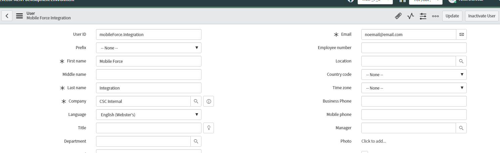

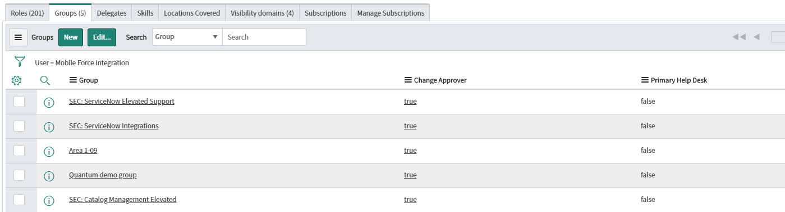

Note: Area01-09 is wm\_work group which is access group to the groups
added to this particular group.

Permissions & Domain
--------------------

-   Roles granted are contained in the 'SEC: ServiceNow Integrations'
    group membership

-   In addition, because the account will be querying on behalf of
    technicians assigned work order tasks across multiple
    companies/domains, the user needs to belong to the 'Work Management
    -- Technicians' group (or similar).

-   This group provides visibility to TOP/GBP/Comm, the parent domain of
    commercial clients

-   The comm domain gives access to the Work order, Work order Task and
    users created and updated below /Comm domain. Anything above /Comm
    which are Top and Global are not accessible using this user domain
    visibility.

ServiceNow Group
--------------------

WM\_Work Group should be created for the service account. This group is
not an assignment group and is needed for access to be cascaded down to
technicians.

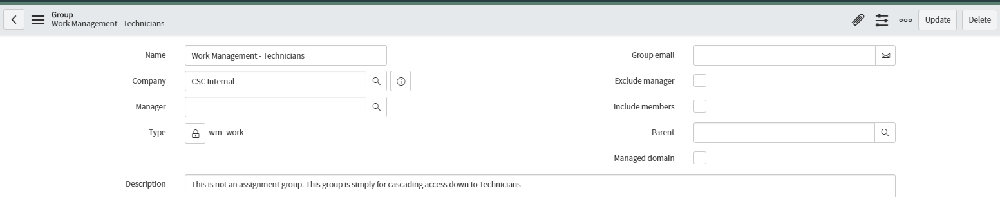

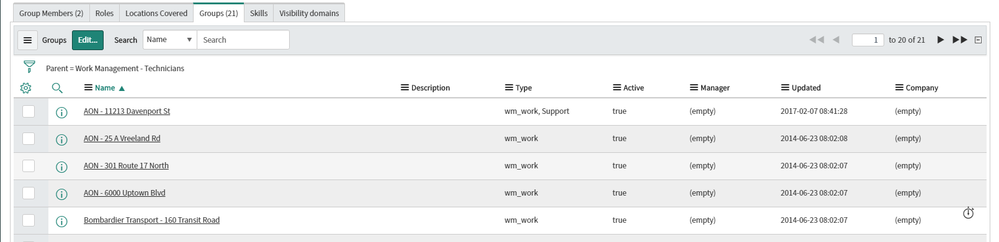

Account Specific ConnectNow Configuration
-----------------------------------------

Group access to service account

-   Work Group access e.g wm\_work group created to cascade access.
    [Area
    1-09](https://cscdev.service-now.com/sys_user_group.do?sys_id=9cf07be96fc6a100c5afed5dbb3ee4f2)

-   [SEC: ServiceNow
    Integrations](https://cscdev.service-now.com/sys_user_group.do?sys_id=318fd8b36f7129002881ee4dbb3ee41c)

-   [SEC: ServiceNow
    Impersonator](https://csc.service-now.com/sys_user_group.do?sys_id=c7fe83b0db636740ccd8a5db0b961998)

-   [SEC: Catalog Management
    Elevated](https://cscdev.service-now.com/sys_user_group.do?sys_id=572808d5dbf753c0568acebe3b961928)

ConnectNow Definition
--------------------

The ConnectNow Partner Definition Number **CNDEF0001236** must be
available in ServiceNow instance.

ConnectNow Capabilities for field services
==========================================

-   Definition Number: **CNDEF0001236**

-   Integrate Partner: Field Services

-   Description: Container for Global ConnectNow Capabilities. This
    definition has multiple capabilities to integration with mobile
    force.

ConnectNow Capabilities
--------------------
It will have following set of capabilities useable across multiple
customer:

-   <ins>**Inbound Capability**</ins> : An inbound capability is
    defined to allow to update/create wm\_task or ci table through
    ConnectNow


| **Capability Number** | **Name** | **Inbound/Outbound** | **Active** | **Availability Status** |
|---------------------- | -------- | -------------------- | ---------- | ----------------------- |
| CNCAP0001914 | Update CI Record : Enhance | Inbound | True | Prod |
| CNCAP0001916 | SEARCH Open WOT | Inbound | True | Prod |
| CNCAP0001961 | SEARCH Company | Inbound | True | Dev |
| CNCAP0001455 | UPDATE Work Order Task | Inbound | True | Prod |
| CNCAP0001456 | UPDATE Work Order | Inbound | True |  |
| CNCAP0001674 | Create CI | Inbound | True | Dev |
| CNCAP0001842 | GET WOT number list | Inbound | True | Dev |
| CNCAP0001901 | Search Capability Dates Caller | Inbound | True | Dev |
| CNCAP0001992 | Create Incident | Inbound | True | Dev |
| CNCAP0001960 | Search Product Model criteria | Inbound | True | Dev |


-  <ins>**Outbound Capability**</ins>: An outbound capability is
    defined to allow to send an update to customer based on triggers to
    the integrating partner.


| **Capability Number** | **Name** | **Inbound/Outbound** | **Availability Status** |
|---------------------- | -------- | -------------------- | ----------------------- |
| CNCOB0001976 | FTA WOT Assigned to Outbound | Outbound | Dev |


**ConnectNow Definition: Field Service - CNDEF0001236**
=======================================================

Within the ConnectNow framework a definition is setup for each
integrating partner. The definition houses all the required mappings,
validations, and behaviours for processing inbound or outbound
integration communication with the Partner. Definition to support
incoming field services transactions.

CNCAP0001914 - Update CI Record: Enhance

CNCAP0001916 - SEARCH Open WOT

CNCAP0001961 - SEARCH Company

CNCAP0001455 - UPDATE Work Order Task

CNCAP0001456 - UPDATE Work Order

CNCAP0001674 - Create CI

CNCAP0001842 - GET WOT number list

CNCAP0001901 - Search Capability Dates Caller

CNCAP0001992 - Create Incident

CNCAP0001960 - Search Product Model criteria

CNCOB0001976 - FTA WOT Assigned to Outbound

Inbound Capability -- UPDATE Work Order Task
--------------------------------------------

URL : https://cscdev.service-now.com/api/mpsc/connectnow/inbound

A ConnectNow capability is set up per direction and per target table.
They contain the mappings and rules for processing inbound messages or
generating outbound messages. Capability that defines the data
processing for inbound messages that update the target Work Order Task
record specified in the message.

Condition: Action=Update and number\_field=number(WOT Number)

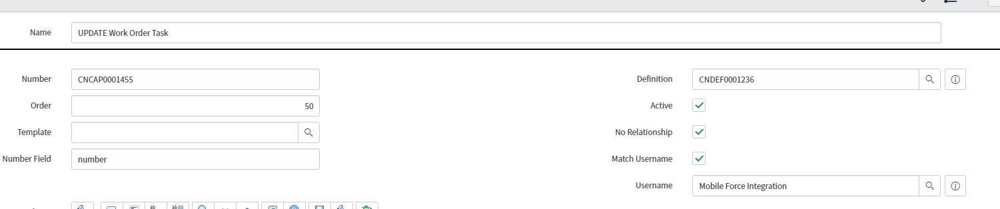

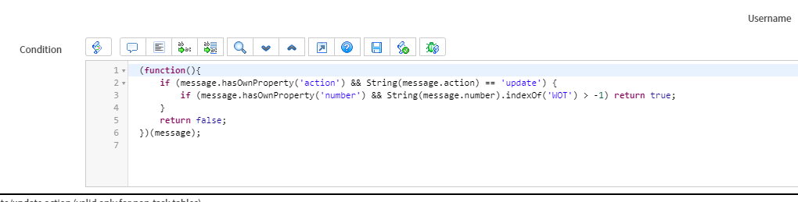

  | **Attribute name** |  **Mandatory** |  **Values Effects** |
  |----------------| ----------- | ------------------------------------------------------------------|
  |Action=update  |  Yes   |      |
  |assigned\_to   |        |      If not send will update the field to null|
  |Comments       |        |     Added to work notes|
  |Location       |        |      If not send will update the field to null|
  |Number         |  Yes   |      Used to determine capability|
  |State          |        |      If not send will update the field to null|
  |u\_substate    |        |      |
  |work\_notes    |  Yes   |      work\_notes|
  |Task\_ci       |        |      First value goes into cmdb\_ci, subsequent goes into affected CI|
  |User\_name     |        |      Mandatory value to update work order task|

**\*Following Fields can be updated using Postman as Post to update work
order task**

**\*\*The value supplied in postman if not found in the corresponding
table will be logged as error in work notes**

  u\_qty <br>
  u\_billing <br>
  u\_routing\_issue <br>
  close\_notes <br>
  u\_customer\_issue <br>
  u\_ci\_update\_status <br>
  u\_description\_issue <br>
  actual\_travel\_start <br>
  work\_end <br>
  expected\_start <br>
  work\_notes <br>
  cmdb\_ci <br>
  Location <br>
  Skills <br>
  State <br>
  sub\_state <br>
  dispatch\_group <br>
  assignment\_group <br>
  assigned\_to <br>
  u\_follow\_up <br>
  follow\_up

**Payload to change all or few of below mentioned Fields of WOT:**

```json
{
"action" : "update",
"assigned_to" : "HaTestWO",
"comments" : "Now with SEC:servinow impersonator group addition",
"location" : "Daletest - Sydney",
"number" : "WOT0012732",
"state" : "17",
"task_ci" : [ "HUNGTEST-ATAG-0001", "HUNGTEST-ATAG-0002" ],
"u_substate" : "",
"user_name" : "myUser21@dxc.com",
"work_notes" : "This is a work note updated by hbusby@csc.com - retest 22"
}
```

**Payload to change the State of WOT:**

**This API can change WOT's state by payload:**

```json
{
    "action" : "update",
	"number" : "WOT0010072",
	"state" : "7",
	"user_name":"adwivedi22@csc.com",
	"work_notes":"test"

}
```
**Allowed States with value integer can be seen below:**

> **Draft = 1**
>
> **Pending Dispatch = 10**
>
> **Assigned = 16**
>
> **Accepted = 17**
>
> **Work In Progress = 18**
>
> **Closed Complete = 3**
>
> **Closed Incomplete = 4**
>
> **Cancelled = 7**

-Mandatory fields for update: \"action\",
\"number\",work\_notes,user\_name

**Note --**

1.  **If null value is updated for State field, WOT will be updated with
    State field as blank.**

2.  **Values other than mentioned above will result in Success without
    changing anything in the WOT State.**

3.  **Updating the status to Pending Dispatch using postman needs work
    notes to be present for WOT update to work along with action, number
    and state.**

### ConnectNow Transforms - Can Update WOT

A ConnectNow Transforms is set up for FTA to be able to cancel WOT from
following current status (not from any other current status):

-   Assigned

-   Accepted

-   Work In Progress.

When WOT cancel request is made for a WOT that is in other state, then mentioned above, of WOT it will result in error.

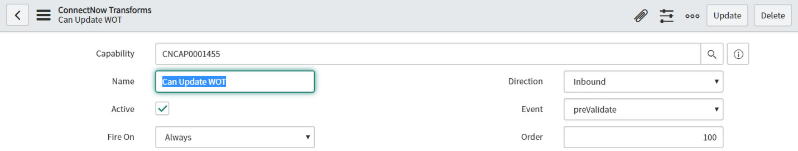

**Note:**

-   The error displayed e.g
    ```json 
    "status_message": "Work order task [WOT0014993] cannot be updated to Cancelled State from Draft State" 
    ```


Inbound Capability -- UPDATE Work Order
---------------------------------------

URL : https://cscdev.service-now.com/api/mpsc/connectnow/inbound

A ConnectNow capability is set up per direction and per target table.
They contain the mappings and rules for processing inbound messages or
generating outbound messages Capability that defines the data processing
for inbound messages that update the target Work Order record specified
in the message.

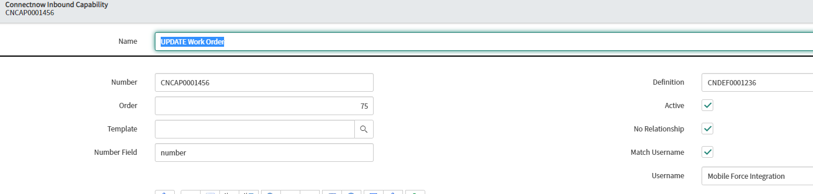

Condition: Action=Update and number\_field=number

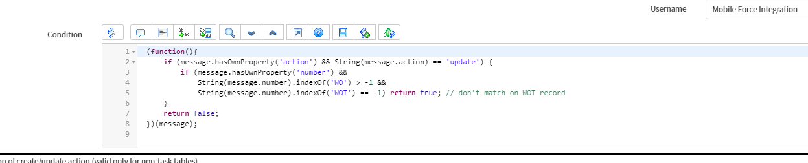

Payload

```json
{
"action" : "update",
"work_notes":"SHORT_DESCRIPTION - NEW_ASSET_TAG_nnguyen77_07",
"number":"WO0017252"
}
```

Inbound Capability -- UPDATE CI Record - Inactive
-------------------------------------------------

Capability that defines the data processing for inbound messages that
update the target Configuration Item record specified in the message.

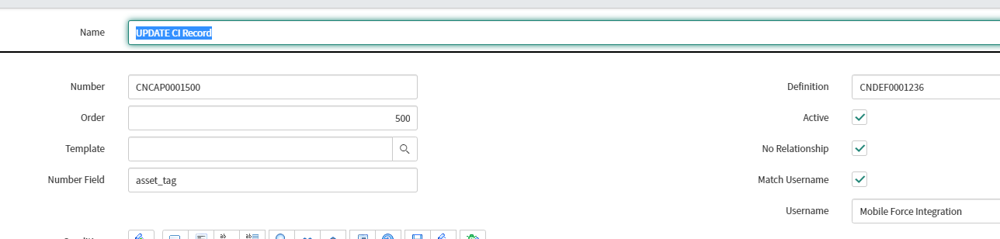
Condition: Action=Update and number\_field=asset\_tag

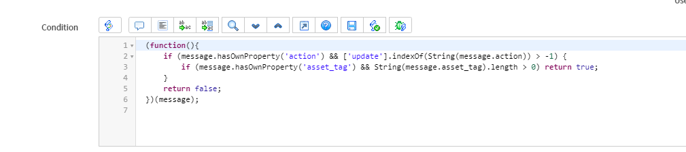

```json
{
"action" : "update",
"asset_tag" : "NEW_ASSET_TAG__17",
"assigned_to": "adwivedi22@csc.com",
"serial_number" : "SERIAL_NUMBER_NEW_ASSET_TAG_3434",
"install_status":"New"
}
```

Inbound Capability -- UPDATE CI Record -- Relationship
------------------------------------------------------

URL : https://cscdev.service-now.com/api/mpsc/connectnow/inbound

Capability that defines the data processing for inbound messages that
update the Configuration Item Relationship record specified in the
message. The relationship will be defined between computer and computer
peripherals class of the CI.

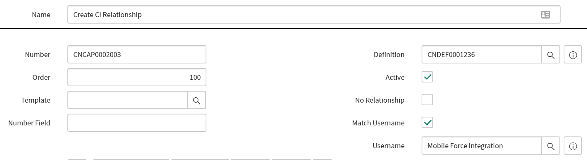

Condition: parentci, childci and relationship are mandatory field.

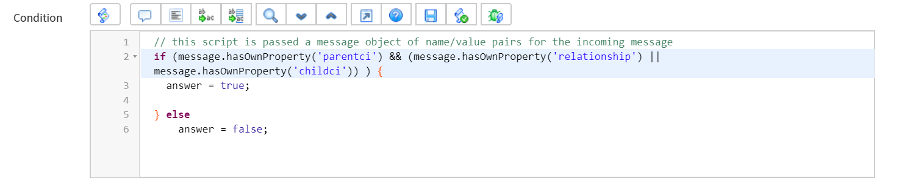

Sample payload:

```json
{
"parentci" : "a84c40cddbed84d8ccd8a5db0b9619f6", 
"childci" : "8be0a6a0dbb122006052fd9eaf9619ea",  
"relationship": "Depends on::Used by"
}
```

Payload Description

Parentci : CI of the cmdb\_ci

Childci : CI of computer peripherals

Relationship: Type of relationship to be added between parentci and
childci.

Note:

-parentci and childci must be the sysid of the CI.

-childci should be Computer or Peripheral.

-Relationship is the type of the relationship which user want to create
between two CI.

-All the ServiceNow existing CI Relationships types are available but at
present the payload should contain Depends On:: Used by relationship.

Inbound Capability -- Create CI Record
--------------------------------------

URL : https://cscdev.service-now.com/api/mpsc/connectnow/inbound

Capability that defines the data processing for inbound messages that
create the target Configuration Item record specified in the message.
There are only two classes (Printer and Computer) where creation of CI
is allowed.

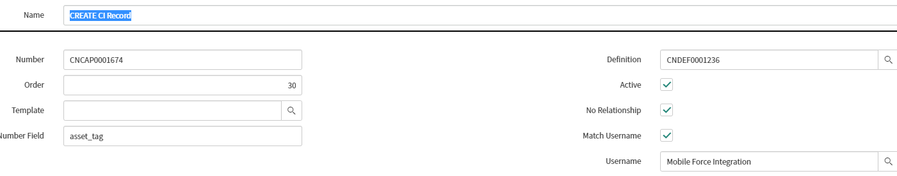

Condition: Action=Create and number\_field=asset\_tag

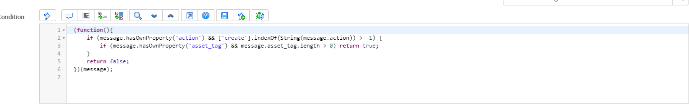

Payload Template:

```json

{
"action" : "create",		
"sys_class_name" : "cmdb_ci_computer",
"asset_tag" : "P1000228-ytran4",		
"company" : "ACME Africa",	
"location" : "100 W Frederick St, Ironwood, MI",
"name" : "*BETH-IBM-ytran4",		
"serial_number": "SERIAL_NUMBER_NEW_ASSET_TAG_18",
"install_status":"Installed",
"assigned_to":"ytran4@dxc.com",
"u_used_for" :  "QA",		
"u_floor" : "2123",		
"u_room" : "20126",		
"u_seat"  : "50",		
"install_date" : "2019-12-12",		
"retired" : "2020-03-03",
"model_id" : "!DB/Explain for DB2 5",		
"manufacturer" : "1000 oaks",	
"WOT_number" : "WOT0010073"
}

```

Mandatory field: \"action\", \"sys\_class\_name\", \"asset\_tag\",
\"company\", \"name\", \"serial\_number\"

Note:

-   Asset field will be auto populated if \"serial\_number\" field is
    unique.

-   Since \"Retired\" field is reference to Asset field, so Asset field
    should always have a value for retired field to populate.

-   \"Manufacturer\" field will be auto populated if payload contains
    \"model\_id\" field.

-   For non-mandatory fields when a wrong value is supplied the CI is
    still created but the respective field of the wrong value is not
    populated, and related message is sent back.

Example: When wrong / inactive WOT is sent in payload it will create CI
and will NOT associate it to WOT. Following message is sent as response:

```json
"Supplied Work Order Task number supplied was either not found or inactive, the new CI record created could not be associated to the Work Order Task."
```
-   For mandatory fields when a wrong value is supplied the CI is NOT
    created and related message is sent back.

Inbound Capability- GET WOT number list
---------------------------------------

URL : https://cscdev.service-now.com/api/mpsc/connectnow/inbound

Capability that defines the data processing for inbound messages that
create the target Configuration Item record specified in the message.
This capability creates a records and gets an output List of Work order
tasks associated to an incident or RITM.


Condition : Message contains number (INC or RITM)

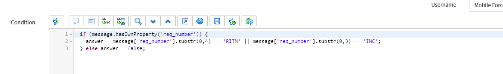

Inbound Capability -- SEARCH Open WOT
-------------------------------------

URL : https://cscdev.service-now.com/api/mpsc/connectnow/inbound

A ConnectNow capability is set up to search open Work Order tasks for
all technicians work group (Assignment Group) that agent belongs to. The
technician should be able to search by keying one of the following
inputs.

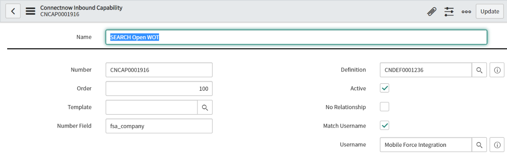

Condition: Message contains properties: company (mandatory) + (email or
wot number)

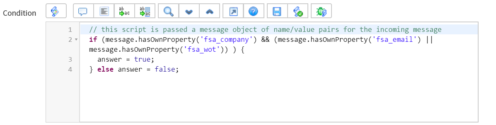

Payload

```json
{
"fsa_company":"CSC Internal",
"fsa_email":"ZZZMVENKATAIAH2@csc.com",
"fsa_wot":""
}
```

fsa\_company : 'Assigned To' engineer company

fsa\_email: 'Assigned To' engineer email.

fsa\_wot: WOT number

<ins>**Logic**</ins>

1\. Get the technician email and company and try to find the related
user from USER table.

2\. For the technician, get the all Groups, of type wm\_work group, that
technician is part of.

3\. For each group get members (i.e. users) of those groups.

4\. For each user in the group, get the assigned WOT that have status of
Draft, Pending Dispatch, Assigned, Accepted, and Work in Progress.

List of Field

-   \"Assignment Group\"

-   \"location.name\"

-   \"short\_description\"

-   \"parent.caller.name\"

-   \"u\_substate"

-   \"WOT number\"

-   \"State\"

##### Sample Output

```json
        "resMessage": "Successful",
            "numberOfMatches": "40",
            "WOT": [
                {
                    "Assignment Group": "Test Loading Assign Group Dependencies",
                    "location.name": "USA street1, US City, USA state",
                    "short_description": "manual SD",
                    "parent.caller.name": "gsTest PortalNoRole",
                    "u_substate": "Awaiting customer",
                    "WOT number": "WOT0012020",
                    "State": "Assigned"
                },

```
Inbound Capability -- SEARCH Company
------------------------------------

URL : https://cscdev.service-now.com/api/mpsc/connectnow/inbound

A ConnectNow capability is set up for field technician to get list of
available company records. This capability searches Company table
(core\_company) and respond with the result based on search criteria.\
It uses the \"contain\" criteria to match the payload search item with
\"name\" on the company form/table.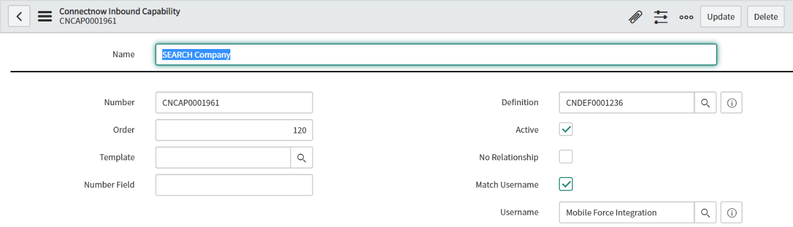{width="6.5in"
height="1.8687489063867018in"}

Condition: Message contains mandatory properties: action=search,
table=core\_company, limit= \<number of records to return\>,
criteria=\<searching contains keyword\>.

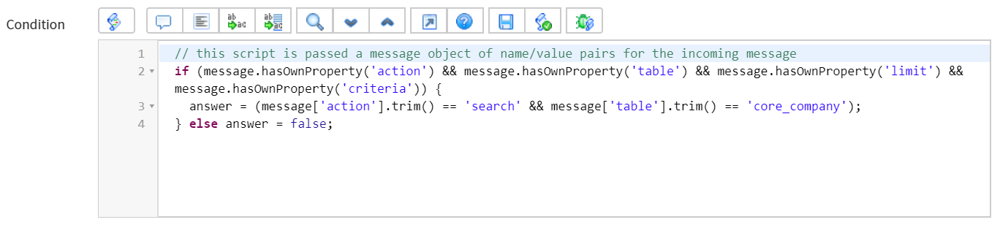

Payload

```json
{
"action" : "search",
"table" : "core_company",
"limit" : "20",
"criteria" : "CSC"
}
```

Inbound Capability -- SEARCH Model
----------------------------------

URL : https://cscdev.service-now.com/api/mpsc/connectnow/inbound

A ConnectNow capability is set up for field technician to get list of
available model records. This capability searches Model table
(cmdb\_model) and respond with the result based on search criteria.\
It uses the \"contain\" criteria to match the payload search item with
\"display name\" on the model form/table.

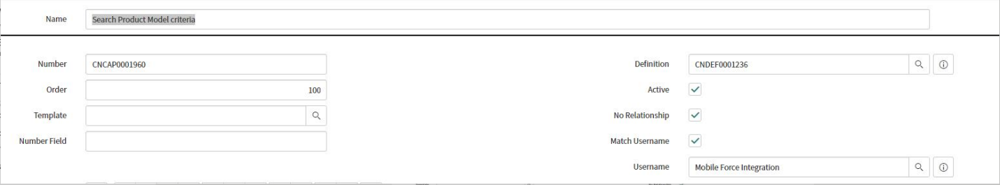

Condition: Message contains mandatory properties: action=search, table=
cmdb\_model, limit= \<number of records to return\>,
manufacturer=\<searching contains keyword\>, name=\<searching contains
keyword\>

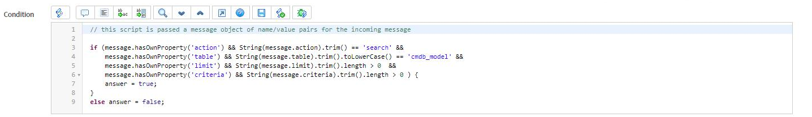

Payload

```json
{                        
"action" : "search",     
"table" : "cmdb_model",     
"limit": "20",     
"manufacturer" : "1000 oaks",
"name" : " Pcast"
}     
     
```
Inbound Capability -- Search Capability Dates Caller
----------------------------------

URL : https://cscdev.service-now.com/api/mpsc/connectnow/inbound

Capability developed to fulfill the requirement from mobile force to be
able to search on dates and caller. The payload contains either update
or create date which is then search against wm\_task table and the
results are send back to mobileforce as response. The payload can
contain following conditions for searching against the servicenow. The
combinations in payload are processed as AND query.

a)  Update date + caller

b)  Create date + caller

c)  Update date

d)  Create date

e)  Caller

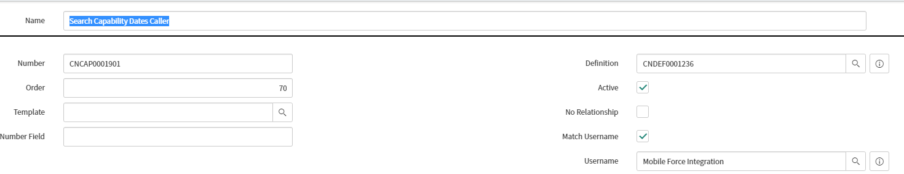


Condition

The action tag from the payload should always have search as value which
is used to define this capability.

e.g Paylaod

```json
{
"action": "search",
"update_date":"",
"create_date":"",
"caller":"adwivedi34@csc.com"
}
```

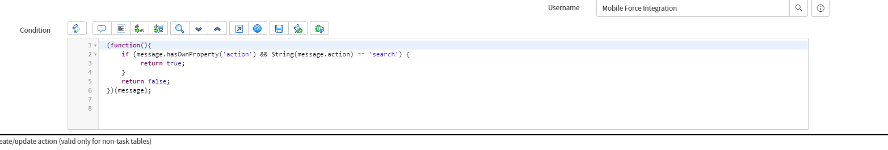

Inbound Capability -- Update CI Record : Enhance
-------------------------------------------------

URL : https://cscdev.service-now.com/api/mpsc/connectnow/inbound

Capability that defines the data processing for inbound messages that
update the target Configuration Item record specified in the message.
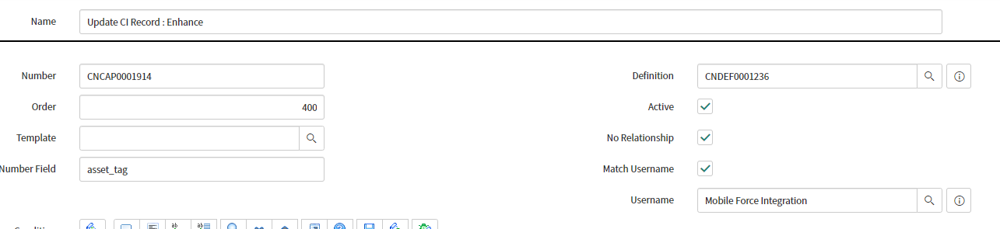


Condition: Action=Update and number\_field=asset\_tag.

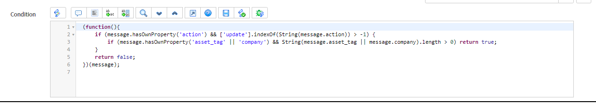


The allow update fields are listed as the follow table

### Allowable Fields

  |**Field**          | **Field\_name**        |  **Type**          |   **Comment** |
  |---------------| -------------------- |----------------- |----------------------------------------------------------------|
  |Name           | Name               |  Normal field   |  | 
  |Serial Number  |serial\_number      | Normal field    |  |
  |Used for       | u\_used\_for       |  Choice field   |   Should be a choice from the list|
  |Floor          | u\_floor           |  Normal field   |   |
  |Room           | u\_room            |  Normal field   |   |
  |Seat           | u\_seat            |  Normal field   |   |
  |Install Date   | install\_date      |  Date field     |   Should be a valid date in yyyy-mm-dd format|
  |Retired date   | Retired            |  Date field     |   Should be a valid date in yyyy-mm-dd format|
  |Description    |short\_description  | Normal field    |  Text will be overwritten with new message as in payload.|
  |Model ID       |model\_id           | Reference field |  Should be a NAME (not displayname ) of a record in cmdb\_model|
  |Manufacturer   |manufacturer        | Reference field |  Should be a Company name of a record in cmdb\_model|
  |Asset tag      |asset\_tag\_new     | Normal field    |  Mandatory field so It should not be duplicated|
  |State          |Install\_state      | Choice List     |  Should be one of the install\_status value|
  |Location       |Location            | Reference field |  Should be from Location table|
  |Assigned\_to   |Assigned\_to        | Reference field |  Should be from sys\_user table|

### Sample payload : 

```json
{
"action" : "update",
"asset_tag" : "P1000228-htra",
"company" : "Aconex Ltd",
"name" : "*BETH-IBM-htra3",
"serial_number": "SERIAL_NUMBER_NEW_ASSET_TAG_18",
"u_used_for" :  "QA",
"u_floor" : "20",
"u_room" : "2012",
"u_seat"  : "50",
"install_date" : "2019-12-12",
"retired" : "2020-03-03",
"short_description" : "SHORT_DESCRIPTION - NEW_ASSET_TAG_18",
"model_id" : "1000 oaks Test router",
"manufacturer" : "1000 oaks",
"asset_tag_new" : "P1000228-htra3"
}

```

### Get CI List:

FIELDS:\[

{label: \'class\', value: \'sys\_class\_name\'},

{label: \'asset\_tag\', value: \'asset\_tag\'},

{label: \'serial\_number\', value: \'serial\_number\'},

{label: \'name\', value: \'name\'},

{label: \'install\_status\', value: \'install\_status\'},

{label: \'u\_used\_for\', value: \'u\_used\_for\'},

{label: \'company.name\', value: \'company.name\'},

{label: \'location.name\', value: \'location.name\'},

{label: \'location.street\', value: \'location.street\'},

{label: \'location.city\', value: \'location.city\'},

{label: \'location.state\', value: \'location.state\'},

{label: \'location.zip\', value: \'location.zip\'},

{label: \'location.country\', value: \'location.country\'},

{label: \'u\_floor\', value: \'u\_floor\'},

{label: \'install\_date\', value: \'install\_date\'},

{label: \'manufacturer\', value: \'manufacturer.name\'},

{label: \'model\_id\', value: \'model\_id.display\_name\'},

{label: \'assigned\_to\', value: \'assigned\_to\'},

{label: \'short\_description\',value: \'short\_description\'}

### Valid Classes :

\[

// PRINTERS

\'cmdb\_ci\_color\_printer\',\'cmdb\_ci\_mainframe\_printer\',

\'cmdb\_ci\_mfp\_printer\',\'cmdb\_ci\_personal\_printer\',

\'cmdb\_ci\_printer\',\'cmdb\_ci\_standard\_printer\',

\'cmdb\_printer\_instance\',\'cmdb\_print\_queue\_instance\',

// LAPTOPS

\'cmdb\_ci\_laptop\_pc\',\'cmdb\_ci\_rugged\_laptop\_pc\',

// DESKTOPS

\'cmdb\_ci\_desktop\_pc\',\'cmdb\_ci\_computer\',\'cmdb\_ci\_workstation\_pc\',

// MONITORS

\'cmdb\_ci\_display\_monitor\',\'cmdb\_ci\_pc\_hardware\'

\],

### Mandatory Payload

{ \"action\" : \"update\",

\"asset\_tag\" : \"BETH-IBM-ytran4-test6\",

\"company\" : \"ACME Africa\",

\"serial\_number\": \"SERIAL\_NUMBER\_NEW\_ASSET\_TAG\_18\"

}

{

\"action\":\"update\",

\"asset\_tag\":\"Fake 98\",

\"company\":\"CSC Internal\",

\"serial\_number\":\"PC0T7FAV\",

\"cpu\_count\":\"8\"

}

Fields to be added from allowable update list to payload for updates to
CI.

Inbound Capability-Create Incident
-----------------------------------

URL : https://cscdev.service-now.com/api/mpsc/connectnow/inbound

Capability that defines the data processing for inbound messages that
create the target Incident record specified in the message.

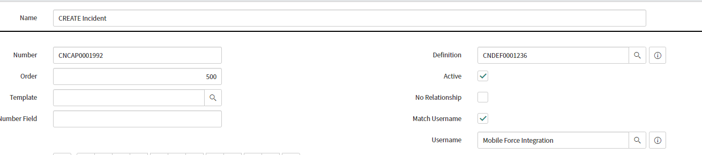

Condition : message.hasOwnProperty(\'fta\_incident\_action\')

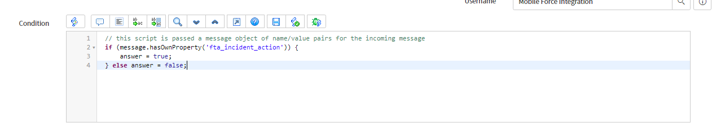

The create fields are listed as below:

 | Field               | Field name             |  Type                    |    Comment|
  |-------------------- |------------------------ |--------------------------- |------------------------------------------------------------|
  |Company              |u\_company              | Mandatory, Reference type  | Should be a valid company NAME|
  |Caller               |u\_caller\_id           | Mandatory, Reference type  | Should be a valid user's ID from the above company|
  |Category             |u\_category             | Mandatory, Choice type     | Should be a choice from the list|
  |Sub-category         |u\_subcategory          | Mandatory, Choice type     | Should be a choice from the list related to above category|
  |Short description    |u\_short\_description   | Mandatory, String type     | |
  |Description          |u \_description         | Mandatory, String type     | |
  |Configuration Item   |u\_configuration\_item  | Optional, Reference type   | Shoulde be a Asset tag of a CI|
  |Impact               |u\_impact               | Optional, Choice type      | Should be a choice from the impact choice list|
  |Urgency              |u\_urgency              | Optional, Choice type      | Should be a choice from the urgency choice list|
  |Opened by            |u\_opened\_by           | Optional, Reference type   | Should be a user's ID|
  |Location             |u\_location             | Optional, Reference type   | Should be a location pair with company|
  |Assignment Group     |u\_assignment\_group    | Optional, Reference type   | Should be an assignment group pair with company|

Note :

-   Caller should be a person from the sent company

-   Opened by's default value is mobileForce.Integration -- if an
    invalid ID is sent, the opened by value will be set to default, else
    if an valid email is sent, opened by will be set to the sent ID.
    Opened by 's ID can be any valid ID in the system -- not need to be
    related to the company

-   State and contact-type is fixed value -- when incident is created
    from this inbound capability, the state will always be NEW and
    contact type is EXTERNAL

-   The domain of the incident will be the domain of one who create the
    incident.

-   Category and sub-catergory's options maybe changes depend on the
    domain of one who create the incident

-   Configuration item should belongs to the sent company.

-   Impact and urgency's default value is 3-Medium.

-   Location should be the name field of a record in the Locations table
    (cmn\_location) that has matching company field as sent in company
    field

-   Assignment Group should be the name field of a record in the Groups
    table

-   (sys\_user\_group ) that has matching company field as sent in
    company field

Sample payload :

```json
{
"fta_incident_action": "insert",
"u_company": " CSC Internal ",
"u_caller_id": "gtran22@csc.com ",
"u_category": "hardware",
"u_subcategory": "Desktop Failure",
"u_short_description": " xxx",
"u_description": " xxx",
"u_urgency": "2",
"u_impact": "4",
"u_opened_by": "vvv",
"u_configuration_item": " AM-D-WinBastion",
"u_location": "123 Main St, Fort Worth, Texas",
"u_assignment_group": "location BASED serVices"
}
```

[Inbound](https://cscdev.service-now.com/u_connectnow_capability.do?sys_id=9ee49ee8db644050da52a2bc0b961908&sysparm_record_target=u_connectnow_capability&sysparm_record_row=1&sysparm_record_rows=9&sysparm_record_list=u_definition%3D0e19c7f0dbdadf40ccd8a5db0b96193f%5EORDERBYDESCsys_updated_on) Capability-Return Mandatory Variables List
------------------------------------------------------------------------------------------------------------------------------------------------------------------------------------------------------------------------------------------------------------------------------------------------------------------------------------------------

URL : https://cscdev.service-now.com/api/mpsc/connectnow/inbound

Capability to find and return mandatory variables for a catalog task.
The inputs for this capability are RITM number and WOT number. The
response of this capability will contain all the mandatory variables
defined for this catalog item which belongs to this catalog task and
RITM, with state and name of the variable.

Condition:

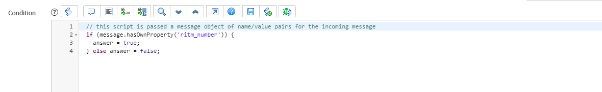
Payload

```json
{   
"ritm_number": "RITM0077033",
"wot_number": "WOT0015150"
}
```

Sample output:


Notes:

-   Mandatory variables list must be mandatory and they are either in
    Work In progress / Close Incomplete / Close Complete state.

[Inbound](https://cscdev.service-now.com/u_connectnow_capability.do?sys_id=9ee49ee8db644050da52a2bc0b961908&sysparm_record_target=u_connectnow_capability&sysparm_record_row=1&sysparm_record_rows=9&sysparm_record_list=u_definition%3D0e19c7f0dbdadf40ccd8a5db0b96193f%5EORDERBYDESCsys_updated_on) Capability- Update Catalog Task Mandatory Variables
---------------------------------------------------------------------------------------------------------------------------------------------------------------------------------------------------------------------------------------------------------------------------------------------------------------------------------------------------------

URL : https://cscdev.service-now.com/api/mpsc/connectnow/inbound

Capability developed to process the inputs from FTA app which contains
catalog task number and variable with value pair information of madatory
task variables. This capability perform update action on catalog task,
checks if the task is updated, Update the Work Order task, close it and
return the WOT state.

Condition: (message.hasOwnProperty(\'catalog\_task\') &&
String(message.catalog\_task).length \> 0)

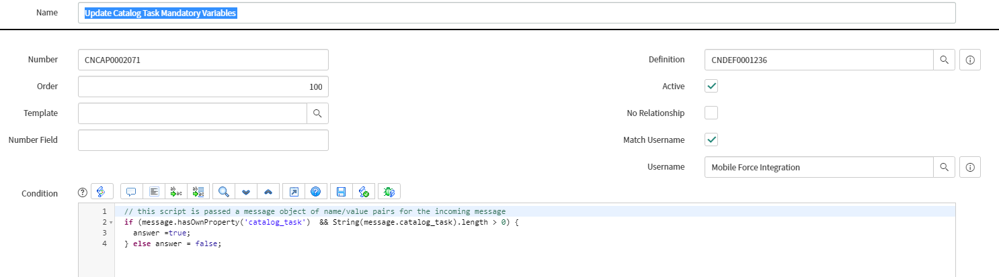

Payload:

Payload must contains the CATALOG TASK NUMBER and pair(s) of mandatory
variable and value.

Sample Output:

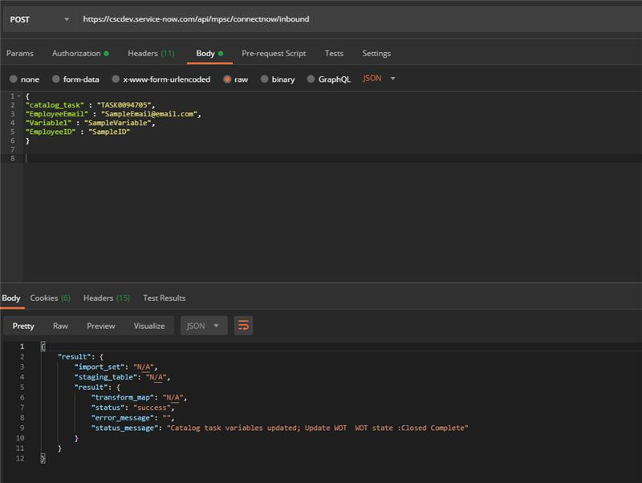

Notes :

-   If the catalog task is updated with variables but work order task
    can't be updated/closed. The variables will be kept but API will
    returns an error message.

-   Work order task should be in Assigned/ Accept/ Work In Progress to
    be able to closed.

Outbound Capability - FTA WOT 'Assigned to' Notification
--------------------------------------------------------

ServiceNow ConnectNow capability is developed to push the notification
with all relevant information to Field Service Agent mobile application
when a Work Order Task(WOT) is assigned or assignment changes to a
technician. The outbound trigger for this capability is the change of
assigned\_to value in work order task.

Note -- When a currently assigned ticket gets reassigned to none, no
notification is sent out.


Outbound trigger

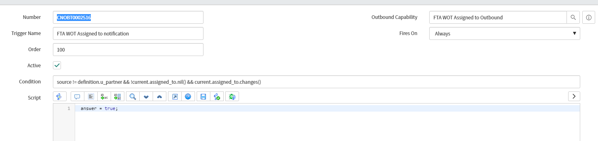

Condition: source != definition.u\_partner &&
!current.assigned\_to.nil() && current.assigned\_to.changes()

Following is the JSON output that is sent as notificaiton to FTA APP

```json
{
   "Domain":"AON_OLD",
   "account":"dxc",
   "action":"assign",
   "app":"dxc",
   "email":"none@email.com",
   "instance":"cscdev",
   "wotId":"WOT0010101"
}
```

\*Domain is the WOT domain. From the hierarchical name of
CSC-ITOP/GBP/Comm/CSC-I, we will extract only CSC-I (i.e. anything after
last \"/\")

\*Instance is ServiceNow instance.

\*email is assigned\_to technician email.

**Update sets**
---------------

The following update sets should be available in the integrating
instance to integrate with MobileForce.

CNOWV2\_Field\_Tech\_Accelerator\_v1.00\_ddelay

CNOWV2\_Field\_Tech\_Accelerator\_v1.00\_ddelay

CNOWV2\_Field\_Tech\_Accelerator\_v1.01\_ddelay

CNOWV2\_Field\_Tech\_Accelerator\_v1.02\_ddelay

CNOWV2\_Field\_Tech\_Accelerator\_v1.03\_ddelay

CNOWV2\_Field\_Tech\_Accelerator\_v1.04\_ddelay

CNOWV2\_Field\_Tech\_Accelerator\_v1.05\_ddelay

CNOWV2\_Field\_Tech\_Accelerator\_v1.06\_ddelay

FTA\_F\_STRY0203220\_0\_adwivedi22

FTA\_F\_STRY0203220\_1\_ytran4

FTA\_F\_STRY0285569\_0\_gtran22

FTA\_F\_STRY0285569\_1\_ytran4

FTA\_F\_STRY0285569\_2\_gtran22

FTA\_F\_STRY0285569\_3\_gtran22

FTA\_F\_STRY0285569\_4\_gtran22

FTA\_F\_STRY0285575\_0\_htra3

FTA\_F\_STRY0285575\_1\_htra3

FTA\_F\_STRY0272523\_0\_ytran4

FTA\_F\_STRY0272523\_1\_gtran22

FTA\_F\_STRY0272523\_2\_htra3

FTA\_F\_STRY0280539\_adwivedi22

FTA\_F\_STRY0285588\_0\_adwivedi22

FTA\_F\_STRY0280525\_0\_htra3

FTA\_F\_STRY0292309\_0\_gtran22

FTA\_F\_STRY0295451\_0\_gtran22

FTA\_F\_STRY0295447\_0\_htra3

FTA\_F\_STRY0295447\_1\_htra3

FTA\_F\_STRY0295431\_0\_adwivedi22

FTA\_F\_STRY0295443\_0\_adwivedi22

FTA\_F\_STRY0298698\_0\_gtran22

FTA\_F\_STRY0298700\_0\_htra3

FTA\_F\_STRY0301952\_0\_skumar62

FTA\_F\_STRY0301952\_0\_htra3

FTA\_F\_STRY0309269\_0\_saggarwal32

FTA\_F\_STRY0309570\_0\_adwivedi22

FTA\_F\_STRY0320407\_0\_htra3

FTA\_F\_STRY0320404\_0\_ytran4

FTA\_F\_STRY0320412\_0\_adwivedi22

FTA\_F\_STRY0320401\_0\_skumar62

**Script Include**
------------------

Following script include is required for field services scripted rest
API.

mobileForceAPI which contains the library of functions for Mobile Force
Field Services calls using the scripted rest API calls.

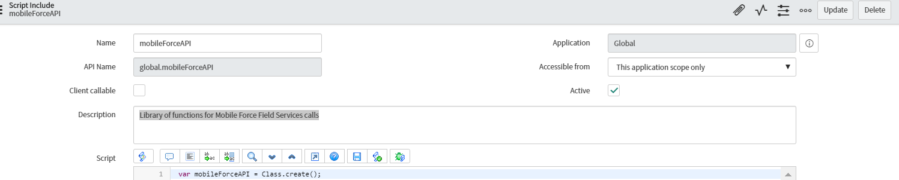{width="6.5in" height="1.3069444444444445in"}

**Mobile Force API provides searching capabilities using target table,
action and query parameters.**

/api/mpsc/fieldservices/mobileforce

Target tables:

-   kb\_knowledge (Knowledge)

-   cmn\_location (Location)

-   cmdb\_ci (CI)

-   sys\_user (Users)

-   wm\_order (Work Order)

\- wm\_task (Work Order Task)

### 

### 

### MobileForce API CI Search Capability


| **API Resource** | **Search Capability**                            |
|----------------------|--------------------------------------------------|
|  CMDB Get CI   | GET <https://cscdev.service-now.com/api/mpsc/fieldservices/mobileforce> <br> Query Params contains of :  <br> action : list  <br> table : cmdb_ci  <br> query : this is ENCODED QUERY of ALL the condition. <br>Limit : <Optional> <br>e.g Query :<br> sys_class_nameINSTANCEOFcmdb_ci_computer^ORsys_class_nameINSTANCEOFcmdb_ci_peripheral


Note:

-   CI is dependent on the domain, so when we query in sub-domain:
    CSC-I, results displayed will be from CSC-I domain.

-   Use the query parameter limit with a positive integer number to
    limit the results. When we use smaller limit than default (2), it
    only shows two results.

-   If we need to use bigger limit than default (20), remove the key
    Limit which will send all the results which are true to the query.

-   Query should be always in ServiceNow format to get results back.

#### Screen Shots

##### Setting Query params

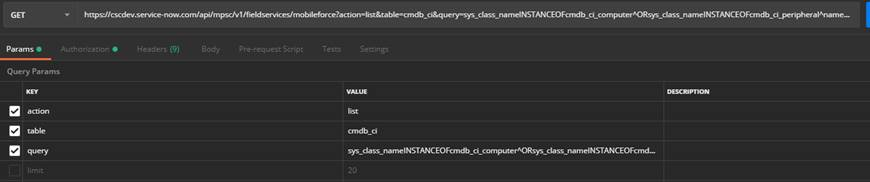

##### Setting Limit:

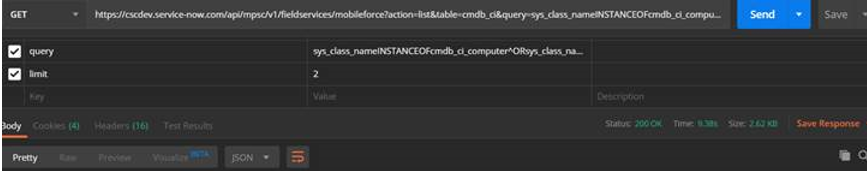

GET CI FIELDS:\[

cmdb\_ci:{

FIELDS:\[

{label: \'class\', value: \'sys\_class\_name\'},

{label: \'asset\_tag\', value: \'asset\_tag\'},

{label: \'serial\_number\', value: \'serial\_number\'},

{label: \'name\', value: \'name\'},

{label: \'install\_status\', value: \'install\_status\'},

{label: \'u\_used\_for\', value: \'u\_used\_for\'},

{label: \'company.name\', value: \'company.name\'},

{label: \'location.name\', value: \'location.name\'},

{label: \'location.street\', value: \'location.street\'},

{label: \'location.city\', value: \'location.city\'},

{label: \'location.state\', value: \'location.state\'},

{label: \'location.zip\', value: \'location.zip\'},

{label: \'location.country\', value: \'location.country\'},

{label: \'u\_floor\', value: \'u\_floor\'},

{label: \'install\_date\', value: \'install\_date\'},

{label: \'manufacturer\', value: \'manufacturer.name\'},

{label: \'model\_id\', value: \'model\_id.display\_name\'},

{label: \'assigned\_to\', value: \'assigned\_to\'},

{label: \'short\_description\',value: \'short\_description\'},

{label: \'sys\_id\', value: \'sys\_id\'}

##### Sample CI Search Result 


```json 
    {
    "status": "success",
    "rows": [
        {
            "class": "Computer",
            "asset_tag": "AE748910",
            "serial_number": "R8L0VNZ",
            "name": "cscindae748910",
            "install_status": "New",
            "u_used_for": "Training",
            "company.name": "DXC Technology",
            "location.name": "",
            "location.street": "",
            "location.city": "",
            "location.state": "",
            "location.zip": "",
            "location.country": "",
            "u_floor": "",
            "install_date": "",
            "manufacturer": "Lenovo",
            "model_id": "Lenovo ThinkCentre M58p",
            "assigned_to": "",
            "short_description": "",
            "sys_id": "00002c98dbbd7b00568acebe3b96199a"
        }
    ]
}
```


### MobileForce API WOT Search by user\_name or user\_email or query Capability

| **API Resource** | **Search Capability**                            |
|------------------|--------------------------------------------------|
| Get WOT          | GET : <br>                                         |
|                  | <https://cscdev.ser                              |
|                  | vice-now.com/api/mpsc/fieldservices/mobileforce> |
|                  |                                                  |
|                  | Query Params contains of :\                      |
|                  | action : list\                                   |
|                  | table : wm\_task                                 |
|                  |                                                  |
|                  | query : this is ENCODED QUERY of ALL the         |
|                  | condition.                                       |
|                  |                                                  |
|                  | (or user\_name: \<Assigned to name\>)            |
|                  |                                                  |
|                  | (or user\_email: \<Assigned to email\>)          |
|                  |                                                  |
|                  | type: all                                        |
|                  |                                                  |
|                  | limit : \<Optional\>                             |
|                  |                                                  |
|                  | e.g Query:                                       |
|                  | u\_work\_order.caller.nameCONTAINSchan           |
+------------------+--------------------------------------------------+

**Note:**

-   **If type param is all, the data results won't return some record
    with Cancelled , Close and Complete state**

#### Screen Shots

#### Search by user\_email

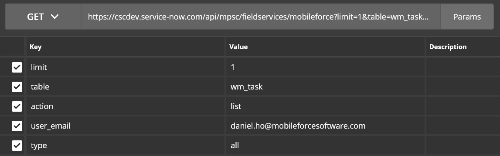{width="6.5in" height="2.0347222222222223in"}

#### Search by user\_name

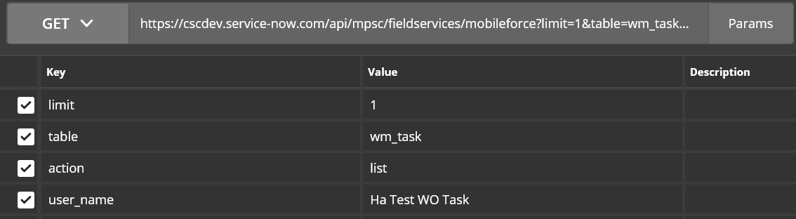{width="6.5in" height="1.7881944444444444in"}

#### Search by Caller Email using Query Param

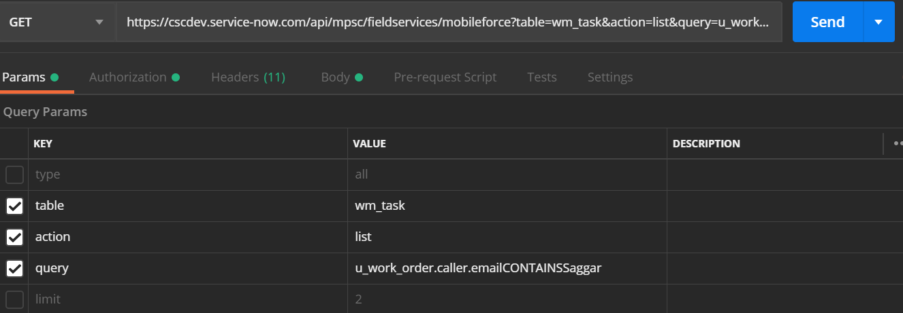{width="6.5in" height="2.2618055555555556in"}

#### Sample WOT Search Result

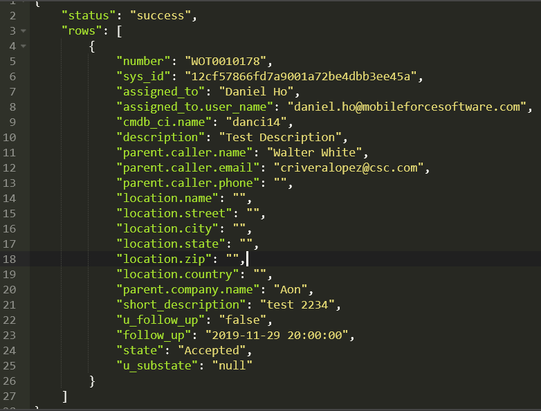{width="6.5in" height="4.9375in"}

**Scripted REST API: Field Services**
-------------------------------------

Following Scripted REST APIs are also used along with ConnectNow
definition for field services.This a direct web services for data
retrieval and uses functions defined in scripted rest API(field
services) which uses script include. (mobileForceAPI).

A wide variety of actions are available to the Field Engineers that
result in an API call to the "Field Services" REST Web Service API.
These are direct API calls which are processed through the resources in
this API to send the result back to Mobile force. The following are the
resource related details

-   Attachment (GET)

-   CMDB Detail (GET)

-   KB Detail (GET)

-   Mobile Force (GET)

-   WO Task Detail (GET)

-   Upload Attachment (POST)

    1.  The user\_name should be a valid servicenow user id.

    2.  Impersonation is used to attach the user\_name to wm\_task with
        attachment

    3.  Admin and non-existing accounts cannot be impersonated, and
        transaction will fail.

-   Delete Attachment (Delete)

    -   The attachment can be only deleted by the user who has created
        it.

    -   ACL present in system restricts deletion of attachments when the
        created by is not the same as deleted by. The admin can override
        this ACL and has delete permissions.

    -   The delete restriction is same for both UI interface and API's.

Each specific action within the Field Support app is defined with the
appropriate API call details.

To do the data retrieval Scripted REST API has been used:

-   Name - "Field Services"

-   API namespace: "mpsc"

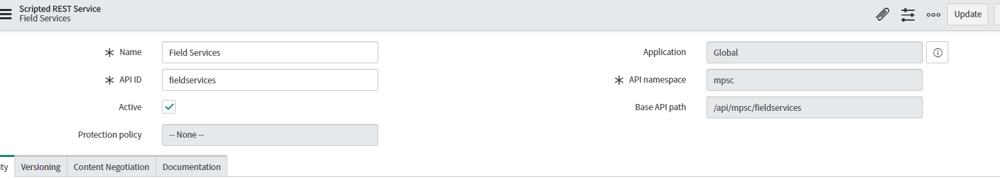{width="6.5in" height="1.1645833333333333in"}

  API Resource -- Mobile Force        Used for returning lists of data based on supplied query conditions. Primarily used for displaying Tasks assigned to the Engineer and providing the picklist options for fields such as Locations, Users, CI and Knowledge. Mandatory variable(s) is available with possible value \<TRUE/FALSE\>
  ----------------------------------- ---------------------------------------------------------------------------------------------------------------------------------------------------------------------------------------------------------------------------------------------------------------------------------------------------
  API Resource -- WO Task Detail      Used for returning the detail for a specific Work Order Task record.
  API Resource -- CMDB Detail         Used for returning the detail for a specific CI record.
  API Resource -- KB Detail           Used for returning the detail for a specific Knowledge Article record.
  API Resource -- Attachment          Used for returning the detail for a specific Attachment record.
  API Resource - Upload Attachment    Used for associating attachments from Field Technician Application (FTA) to specific WOT.
  API Resource -- Delete Attachment   Used for deleting single attachment identified by sys\_id provided by FTA app

This API have following methods:

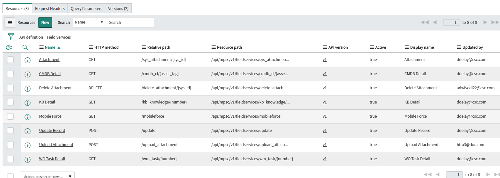

| **Name**        | **Action** | **Resource Path**    | **Description** |
|-----------------|------------|----------------------|-----------------|              
| Field Services  |            | /api/mpsc/fieldservices        | Used for returning lists of data based on supplied query conditions        |
| **API  Resources** |
|Attachment| GET| /api/mpsc/fieldservices/sys_attachment/{sys_id} <br> | API resource used to retrieve a specific attachment record from ServiceNow. |
| CMDB Detail | GET | /api/mpsc/fieldservices/cmdb_ci/{asset_tag} | API resource used to retrieve a specific CI record from the cmdb_ci table within the ServiceNow CMDB. |
| KB Detail | GET | /api/mpsc/fieldservices/kb_knowledge/{number} | API resource used to retrieve a specific knowledge article record from ServiceNow. |
| Mobile Force | GET | /api/mpsc/fieldservices/mobileforce <br> Target tables: <br> -	kb_knowledge (Knowledge) <br> -	cmn_location (Location) <br> -	cmdb_ci (CI) <br> -	sys_user (Users) <br> -	wm_order (Work Order) <br> -       wm_task (Work Order Task) | API resource used to return listed results based on the query parameters supplied. | 
|WO Task Detail | GET | /api/mpsc/fieldservices/wm_task/{number} | API resource used to retrieve the detail for a specific Work Order Task record from ServiceNow. |
| Update Record | POST | /api/mpsc/fieldservices/update | API resource for update. |
| Upload Attachment | POST | /api/mpsc/fieldservices/upload_attachment | API resource to upload attachment | 
| Delete attacment | Delete | /api/mpsc/fieldservices/delete_attachment/{sys_id} | API resource to delete single sys_id of attachment | 


### 

### Scripted Rest API Enhancements

###  

| **API Resource** | **Enhancements**                                 |
|------------------|--------------------------------------------------|
| WO Task Detail   | -   Initiated From                               |
|                  |                                                  |
|                  | -   Initiated from RITM                          |
|                  |                                                  |
|                  | -   WOT Caller                                   |
|                  |                                                  |
|                  | -   Create Date                                  |
|                  |                                                  |
|                  | -   Update Date                                  |
|                  |                                                  |
|                  | -   SLA details                                  |
|                  |                                                  |
|                  | 1.  have been added in output. Changes are made  |
|                  |     to script include mobileforceAPI to achieve  |
|                  |     this. Sprint                                 |
|                  |     18/[W                                        |
|                  | MSM-1090](https://jira.csc.com/browse/WMSM-1090) |

#### WO DETAIL Fields

{label:\'sys\_id\', value: \'sys\_id\'},

{label:\'number\', value: \'number\'},

{label:\'parent.company.name\',value:\'parent.company.name\'},

{label:\'cmdb\_ci.name\',value:\'cmdb\_ci.name\'},

{label:\'cmdb\_ci.asset\_tag\',value:\'cmdb\_ci.asset\_tag\'},

{label:\'initiated\_from.number\',value:\'initiated\_from.number\'},

{label:\'u\_initiated\_from\_ritm.number\',value:\'u\_initiated\_from\_ritm.number\'},

{label:\'follow\_up\',value:\'follow\_up\'},

{label:\'parent.number\',value:\'parent.number\'},

{label:\'state\',value:\'state\'},

{label:\'u\_substate\',value:\'u\_substate\'},

{label:\'dispatch\_group.name\',value:\'dispatch\_group.name\'},

{label:\'assignment\_group.name\',value:\'assignment\_group.name\'},

{label:\'assigned\_to.user\_name\',value:\'assigned\_to.user\_name\'},

{label:\'assigned\_to.first\_name\',value:\'assigned\_to.first\_name\'},

{label:\'assigned\_to.last\_name\',value:\'assigned\_to.last\_name\'},

{label:\'assigned\_to.sys\_id\', value:\'assigned\_to.sys\_id\'},

{label:\'opened\_at\',value:\'opened\_at\'},

{label:\'u\_created\_on\',value:\'u\_created\_on\'},

{label:\'sys\_created\_on\',value:\'sys\_created\_on\'},

{label:\'sys\_updated\_on\',value:\'sys\_updated\_on\'},

{label:\'u\_follow\_up\',value:\'u\_follow\_up\'},

{label:\'u\_swivel\',value:\'u\_swivel\'},

{label:\'short\_description\',value:\'short\_description\'},

{label:\'description\',value:\'description\'},

{label: \'u\_mandatory\_questions\', value: \'u\_question\'},

//planned tab

{label:\'window\_start\',value:\'window\_start\'},

{label:\'window\_end\',value:\'window\_end\'},

{label:\'expected\_travel\_start\',value:\'expected\_travel\_start\'},

{label:\'expected\_start\',value:\'expected\_start\'},

{label:\'estimated\_end\',value:\'estimated\_end\'},

{label:\'is\_fixed\_window\',value:\'is\_fixed\_window\'},

{label:\'estimated\_travel\_duration\',value:\'estimated\_travel\_duration\'},

{label:\'estimated\_work\_duration\',value:\'estimated\_work\_duration\'},

//actual

{label:\'actual\_travel\_start\',value:\'actual\_travel\_start\'},

{label:\'work\_start\',value:\'work\_start\'},

{label:\'work\_end\',value:\'work\_end\'},

{label:\'actual\_travel\_duration\',value:\'actual\_travel\_duration\'},

{label:\'calendar\_duration\',value:\'calendar\_duration\'},

//caller

{label:\'parent.caller.name\', value:\'parent.caller.name\'},

{label:\'parent.caller.first\_name\',
value:\'parent.caller.first\_name\'},

{label:\'parent.caller.last\_name\',
value:\'parent.caller.last\_name\'},

{label:\'parent.caller.user\_name\',
value:\'parent.caller.user\_name\'},

{label:\'parent.caller.company.name\',
value:\'parent.caller.company.name\'},

{label:\'parent.caller.location.name\',value:\'parent.caller.location.name\'},

{label:\'parent.caller.email\', value:\'parent.caller.email\'},

{label:\'parent.caller.phone\', value:\'parent.caller.phone\'},

{label:\'parent.caller.mobile\_phone\',
value:\'parent.caller.mobile\_phone\'},

// location

{label:\'location.name\', value:\'location.name\'},

{label:\'location.street\', value:\'location.street\'},

{label:\'location.city\', value:\'location.city\'},

{label:\'location.state\', value:\'location.state\'},

{label:\'location.zip\', value:\'location.zip\'},

{label:\'location.country\',value:\'location.country\'},

{label:\'location.phone\', value:\'location.phone\'},

{label:\'location.sys\_id\', value:\'location.sys\_id\'},

// closure information

{label:\'u\_ci\_update\_status\',value:\'u\_ci\_update\_status\'},

{label:\'close\_notes\',value:\'close\_notes\'},

{label:\'u\_description\_issue\',value:\'u\_description\_issue\'},

{label:\'u\_customer\_issue\',value:\'u\_customer\_issue\'},

{label:\'u\_routing\_issue\',value:\'u\_routing\_issue\'},

{label:\'u\_qty\',value:\'u\_qty\'},

{label:\'u\_billing.number\',value:\'u\_billing.number\'}, //
ast\_contract

{label:\'u\_billing.vendor\_contract\',
value:\'u\_billing.vendor\_contract\'}, // contract number

// dates

{label:\'sys\_created\_on\',value:\'sys\_created\_on\'},

{label:\'sys\_created\_by\',value:\'sys\_created\_by\'},

{label:\'sys\_updated\_on\',value:\'sys\_updated\_on\'},

{label:\'sys\_updated\_by\',value:\'sys\_updated\_by\'},

{label:\'knowledge\',value:\'knowledge\'},

{label:\'impact\', value:\'impact\'},

{label:\'urgency\', value:\'urgency\'},

{label:\'priority\', value:\'priority\'}

\],

RELATED\_LISTS:\[ {

name:\'task\_ci\',

name:\'task\_sla\',

name: \'activity\',

name: \'attachments\',}\]

#### Sample Result

    \"sys\_id\": \"62a07f11dbe7b388da52a2bc0b961981\",

    \"number\": \"WOT0014858\",

    \"parent.company.name\": \"DXC Technology\",

    \"cmdb\_ci.name\": \"\",

    \"cmdb\_ci.asset\_tag\": \"\",

    \"initiated\_from.number\": \"TASK0074104\",

    \"u\_initiated\_from\_ritm.number\": \"RITM0061251\",

    \"follow\_up\": \"\",

    \"parent.number\": \"WO0017260\",

    \"state\": \"Assigned\",

    \"u\_substate\": \"\",

    \"dispatch\_group.name\": \"Daletest - Sydney Dispatch\",

    \"assignment\_group.name\": \"Daletest - Sydney (Work)\",

    \"assigned\_to.user\_name\": \"dpoisseroux\@csc.com\",

    \"assigned\_to.first\_name\": \"Didier\",

    \"assigned\_to.last\_name\": \"Poisseroux\",

    \"assigned\_to.sys\_id\": \"31a3e4076f9fd1001a72ee4dbb3ee438\",

    \"opened\_at\": \"2019-08-28 05:10:57\",

    \"u\_created\_on\": \"2019-08-28 05:09:45\",

    \"sys\_created\_on\": \"2019-08-28 05:10:57\",

    \"sys\_updated\_on\": \"2019-08-30 01:18:12\",

    \"u\_follow\_up\": \"false\",

    \"u\_swivel\": \"false\",

    \"short\_description\": \"Daletest APAC test item\",

\"description\": \"\\nUser name: : Dale Crawford\\nFirst Name:  : Dale\\nLast Name:  : Crawford\\nEmail Address: : dcrawfo6\@dxc.com\\nUser ID: : dcrawfo6\@csc.com\\nUser Telephone Number: : (012) 345-6789\\nUser Location: : Daletest - Sydney\\nHow much RAM do you need? : 4GB\\nWhat size hard drive do you need? : 500GB\\nDo you need a Docking station? : false\",

\"u\_mandatory\_questions\": \"false\",

    \"window\_start\": \"2019-08-28 05:10:57\",

    \"window\_end\": \"\",

    \"expected\_travel\_start\": \"2019-08-28 05:10:58\",

    \"expected\_start\": \"2019-08-28 05:10:58\",

    \"estimated\_end\": \"2019-08-28 06:10:58\",

    \"is\_fixed\_window\": \"false\",

    \"estimated\_travel\_duration\": \"\",

    \"estimated\_work\_duration\": \"1 Hour\",

    \"actual\_travel\_start\": \"\",

    \"work\_start\": \"\",

    \"work\_end\": \"\",

    \"actual\_travel\_duration\": \"\",

    \"calendar\_duration\": \"\",

    \"parent.caller.name\": \"Dale Crawford\",

    \"parent.caller.first\_name\": \"Dale\",

    \"parent.caller.last\_name\": \"Crawford\",

    \"parent.caller.user\_name\": \"dcrawfo6\@csc.com\",

    \"parent.caller.company.name\": \"DXC Technology\",

    \"parent.caller.location.name\": \"Daletest - Sydney\",

    \"parent.caller.email\": \"dcrawfo6\@dxc.com\",

    \"parent.caller.phone\": \"(012) 345-6789\",

    \"parent.caller.mobile\_phone\": \"\",

    \"location.name\": \"Daletest - Sydney\",

    \"location.street\": \"123 any street\",

    \"location.city\": \"\",

    \"location.state\": \"\",

    \"location.zip\": \"\",

    \"location.country\": \"Australia\",

    \"location.phone\": \"\",

    \"location.sys\_id\": \"3354017d6f7f6940c5afbd5dbb3ee41a\",

    \"u\_ci\_update\_status\": \"\",

    \"close\_notes\": \"\",

    \"u\_description\_issue\": \"false\",

    \"u\_customer\_issue\": \"false\",

    \"u\_routing\_issue\": \"false\",

    \"u\_qty\": \"\",

    \"u\_billing.number\": \"\",

    \"u\_billing.vendor\_contract\": \"\",

    \"sys\_created\_by\": \"dcrawfo6\@csc.com\",

    \"sys\_updated\_by\": \"dcrawfo6\@csc.com\",

    \"knowledge\": \"false\",

    \"impact\": \"3 - Low\",

    \"urgency\": \"3 - Low\",

    \"priority\": \"3 - Medium\",

    \"task\_ci\": \[\],

    \"parent\_sla\": \[

        {

            \"sla\": \"Task Test RLN Catalog Task\",

            \"has\_breached\": \"true\",

            \"stage\": \"In progress\",

            \"task\": \"TASK0074104\",

            \"start\_time\": \"2019-08-28 05:09:45\",

            \"planned\_end\_time\": \"2019-08-28 05:24:45\",

            \"xml\": \"null\"

        }

    \],

    \"parent\_sla1\": \[

        {

            \"sla\": \"Daletest RITM\",

            \"has\_breached\": \"true\",

            \"stage\": \"In progress\",

            \"task\": \"RITM0061251\",

            \"start\_time\": \"2019-08-28 05:09:35\",

            \"planned\_end\_time\": \"2019-08-28 06:09:35\",

            \"xml\": \"null\"

        },

        {

            \"sla\": \"\",

            \"has\_breached\": \"true\",

            \"stage\": \"In progress\",

            \"task\": \"RITM0061251\",

            \"start\_time\": \"2019-08-28 05:09:35\",

            \"planned\_end\_time\": \"2019-08-29 05:09:35\",

            \"xml\": \"null\"

        },

        {

            \"sla\": \"\",

            \"has\_breached\": \"true\",

            \"stage\": \"In progress\",

            \"task\": \"RITM0061251\",

            \"start\_time\": \"2019-08-28 05:09:35\",

            \"planned\_end\_time\": \"2019-08-29 05:09:35\",

            \"xml\": \"null\"

        },

        {

            \"sla\": \"\",

            \"has\_breached\": \"true\",

            \"stage\": \"In progress\",

            \"task\": \"RITM0061251\",

            \"start\_time\": \"2019-08-28 05:09:35\",

            \"planned\_end\_time\": \"2019-08-29 05:09:35\",

            \"xml\": \"null\"

        },

        {

            \"sla\": \"\",

            \"has\_breached\": \"true\",

            \"stage\": \"In progress\",

            \"task\": \"RITM0061251\",

            \"start\_time\": \"2019-08-28 05:09:35\",

            \"planned\_end\_time\": \"2019-08-29 05:09:35\",

            \"xml\": \"null\"

        },

        {

            \"sla\": \"RITM-SNB-453-SAH-No-Variable\",

            \"has\_breached\": \"true\",

            \"stage\": \"In progress\",

            \"task\": \"RITM0061251\",

            \"start\_time\": \"2019-08-28 05:09:35\",

            \"planned\_end\_time\": \"2019-08-28 05:39:35\",

            \"xml\": \"null\"

        },

        {

            \"sla\": \"Deepti\_check SLA\",

            \"has\_breached\": \"true\",

            \"stage\": \"In progress\",

            \"task\": \"RITM0061251\",

            \"start\_time\": \"2019-08-28 05:09:35\",

            \"planned\_end\_time\": \"2019-08-28 13:09:35\",

            \"xml\": \"null\"

        }

    \],

    \"activity\": \[

        {

            \"element\": \"work\_notes\",

            \"value\": \"Work Note from WO0017260 :\\n2019-08-30 11:18:12 - Dale Crawford (Work notes)\\nwork notes on WO\\n\\n\",

            \"sys\_created\_on\": \"2019-08-30 01:18:12\",

            \"sys\_created\_by\": \"dcrawfo6\@csc.com\",

            \"name\": \"Dale Crawford\"

        },

        {

            \"element\": \"comments\",

            \"value\": \"Adding Comments to the WOT.\",

            \"sys\_created\_on\": \"2019-08-28 22:53:56\",

            \"sys\_created\_by\": \"mali206\@dxc.com\",

            \"name\": \"Sunny Ali\"

        },

        {

            \"element\": \"work\_notes\",

            \"value\": \"Work Note from TASK0074104 :\\n2019-08-28 15:17:00 - Dale Crawford (Work notes)\\nwork notes added to CTASK\\n\\n\",

            \"sys\_created\_on\": \"2019-08-28 05:17:00\",

            \"sys\_created\_by\": \"dcrawfo6\@csc.com\",

            \"name\": \"Dale Crawford\"

        },

        {

            \"element\": \"work\_notes\",

            \"value\": \"Additional comments from TASK0074104 :\\n2019-08-28 15:16:33 - Dale Crawford (Additional comments)\\nadditional comments added to CTASK\\n\\n\",

            \"sys\_created\_on\": \"2019-08-28 05:16:34\",

            \"sys\_created\_by\": \"dcrawfo6\@csc.com\",

            \"name\": \"Dale Crawford\"

        },

        {

            \"element\": \"work\_notes\",

            \"value\": \"work note from WOT\",

            \"sys\_created\_on\": \"2019-08-28 05:12:04\",

            \"sys\_created\_by\": \"dcrawfo6\@csc.com\",

            \"name\": \"Dale Crawford\"

        },

        {

            \"element\": \"comments\",

            \"value\": \"additional comment from WOT\",

            \"sys\_created\_on\": \"2019-08-28 05:11:54\",

            \"sys\_created\_by\": \"dcrawfo6\@csc.com\",

            \"name\": \"Dale Crawford\"

        },

        {

            \"element\": \"work\_notes\",

            \"value\": \"Work Note from WO0017260 :\\n2019-08-28 15:11:02 - Dale Crawford (Work notes)\\nAutomatically set to Assigned as some tasks are assigned\\n\\n\",

            \"sys\_created\_on\": \"2019-08-28 05:11:02\",

            \"sys\_created\_by\": \"dcrawfo6\@csc.com\",

            \"name\": \"Dale Crawford\"

        },

        {

            \"element\": \"work\_notes\",

            \"value\": \"Auto-generated first task for WO0017260\",

            \"sys\_created\_on\": \"2019-08-28 05:10:57\",

            \"sys\_created\_by\": \"dcrawfo6\@csc.com\",

            \"name\": \"Dale Crawford\"

        }

    \],

    \"attachments\": \[\]

}

#### Exceptions

-   Reference fields will return corresponding record values which might
    be different from label.

\*Location returns location.name as an example

#### Upload Attachment 

+---------------------+---+------------------------------------------+
| API Resource Detail |   | Enhancement Details                      |
+=====================+===+==========================================+
| Upload Attachment   |   | /a                                       |
|                     |   | pi/mpsc/fieldservices/upload\_attachment |
|                     |   |                                          |
|                     |   | e.g                                      |
|                     |   |                                          |
|                     |   | <https://cscdev.service-n                |
|                     |   | ow.com/api/mpsc/fieldservices/upload_att |
|                     |   | achment?table=wm_task&number=WOT0012727> |
|                     |   |                                          |
|                     |   | Inputs                                   |
|                     |   |                                          |
|                     |   | -   Attachment file- file to be attached |
|                     |   |     to wm\_task record                   |
|                     |   |                                          |
|                     |   | -   Table Name- servicenow table         |
|                     |   |     wm\_task                             |
|                     |   |                                          |
|                     |   | -   WOT Number- record to which          |
|                     |   |     attachment needs to be added         |
|                     |   |                                          |
|                     |   | -   User\_name- which would be           |
|                     |   |     associated with the wm\_task         |
|                     |   |                                          |
|                     |   | -   User\_name should be the valid       |
|                     |   |     servicenow user ID.                  |
+---------------------+---+------------------------------------------+

Upload attachment resource enables attachments to be sent from FTA
mobile force app to be added to wm\_task table to a record (WOT number
supplied in payload). All major file types are allowed as an update. The
file size depends on the network speed to servicenow instance. Maximum
allowed network transaction time is 298 secs.

The below points should be considered regarding the user\_name sent from
FTA\_App.

1.  The user\_name should be a valid servicenow user id.

2.  Impersonation is used to attach the user\_name to wm\_task with
    attachment

3.  Admin and non-existing accounts cannot be impersonated, and
    transaction will fail.

4.  The association between user, attachment can be checked on wm\_task
    in servicenow UI.

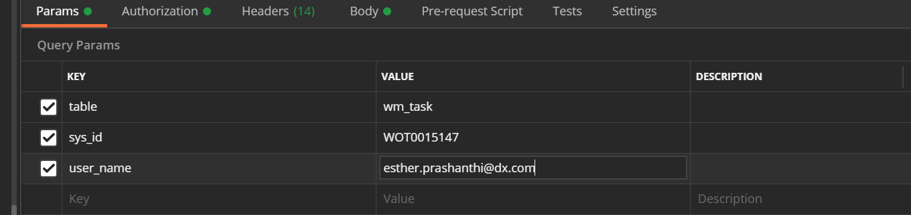{width="6.5in" height="1.538888888888889in"}

The body contains the file to be added after selection in postman. The
type should be selected as binary.

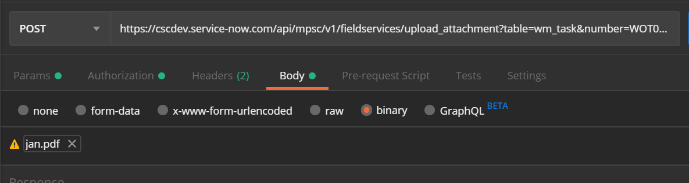{width="6.5in" height="1.7333333333333334in"}

The header requires to have a supplied value of the attachment file name
in the key.

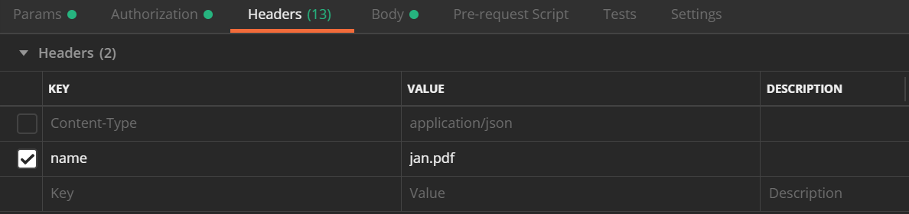{width="6.5in" height="1.5375in"}

The following response is sent back to FTA when an attachment is added
to wm\_task table.

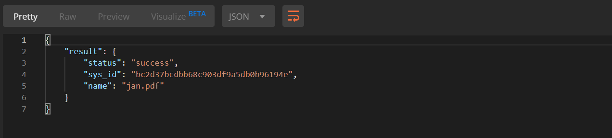{width="6.5in" height="1.4715277777777778in"}
